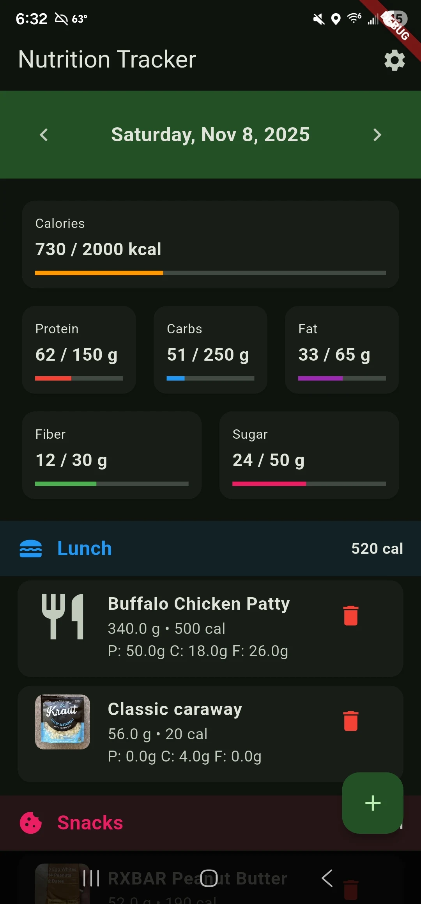
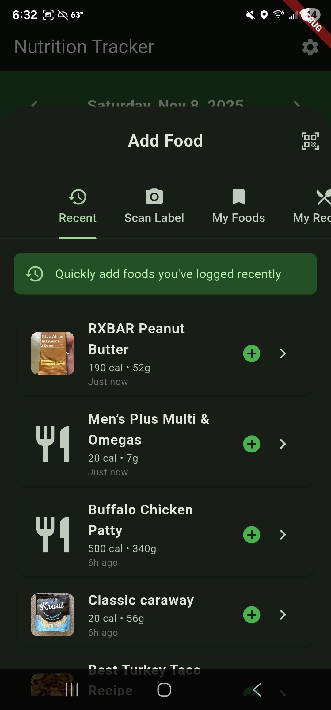
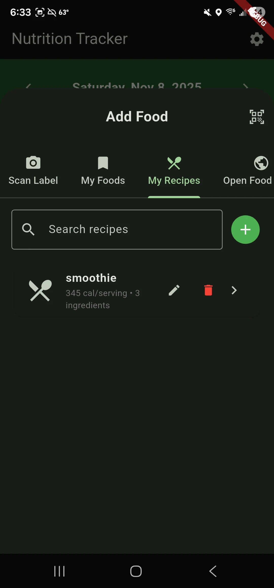
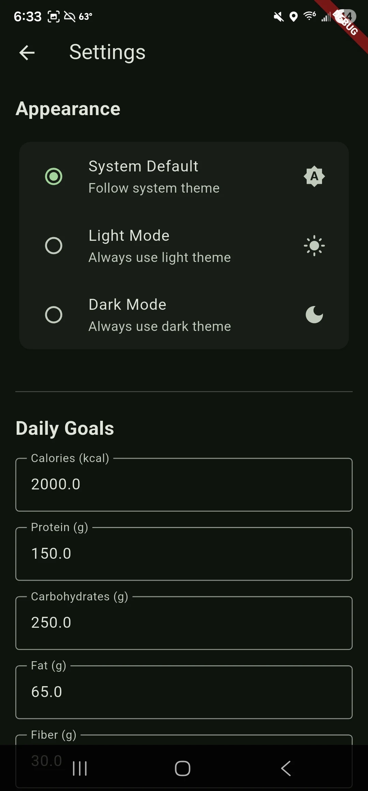
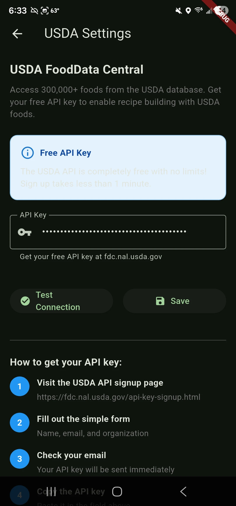

<div align="center">
  <br>
</div>

# Yummer

A nutritional tracker app that allows users to log their meals and track their nutrients while
integrating with OpenFoodFacts, Mealie, and USDA Food Database.

Download on [Google Play Store](https://play.google.com/store/apps/details?id=com.jkstreamin.yummer)

## Overview

Yummer is a Flutter-based mobile application designed to help users monitor their nutritional intake by logging meals and tracking nutrients. The app integrates with popular food databases such as OpenFoodFacts, Mealie, and the USDA Food Database to provide comprehensive nutritional information.

Some of the key features of Yummer include:
- Custom food with photo scanning
- Barcode scanning with OpenFoodFacts integration
- Recipe builder to allow reusable meal
- Mealie integration
- All local data storage with import/export functionality

### Screenshots

<div align="center">
  
  
  
  
  
</div>

## Installation

### web debug

The web needs to disable web security if using mealie to avoid CORS issues.

`flutter run -d chrome --web-port=8090 --web-browser-flag "--disable-web-security" --web-browser-flag "--user-data-dir=/tmp/chrome_dev"`

### android debug

`flutter run -d device id`

### build apk

update version in pubspec.yaml before building
example: version: 1.0.0+1
`flutter build apk --release`

### publish to play store

```
dart pub add rename
dart run rename setBundleId --value com.jkstreamin.yummer
dart run rename setAppName --value "Yummer"
flutter build appbundle --release
```

